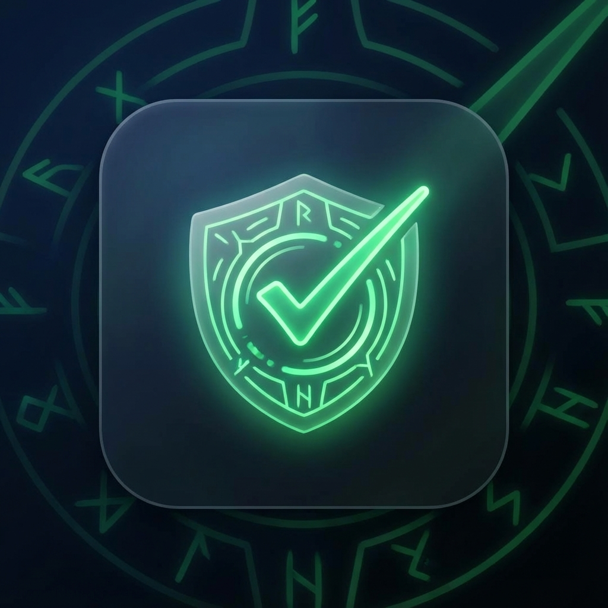

# Ready Check - Dota 2 Party Assistant 🛡️✅

A polished, game-inspired mobile application built with **Flutter** and **Firebase**. 
It helps squads coordinate "Ready Checks" (like in Dota 2) with a full-screen, call-style overlay, real-time chat, and party management.



## Features

- **🛡️ Circles (Parties)**: Create or join squads using unique invite codes.
- **⚡ Summon / Ready Check**: 
  - Host initiates a "Summon".
  - All members receive a **Full Screen Notification** (like an incoming call), even if their phone is locked.
  - 30-second timer to Accept or Decline.
- **💬 Real-time Chat**: Live chat with online/offline status and typing indicators.
- **🎨 Liquid Glass UI**: Custom-built, dark-themed glassmorphism interface.
- **🔔 Push Notifications**: Integrated with FCM for background alerts.

## Tech Stack

- **Frontend**: Flutter (Mobile - Android/iOS)
- **Backend**: Firebase (Firestore, Auth, Storage, Cloud Functions)
- **State Management**: Provider
- **Notifications**: Firebase Cloud Messaging (FCM) + Flutter Local Notifications + Full Screen Intent

---

## Setup & Installation

**Prerequisites**:
- Flutter SDK
- Android Studio / Xcode
- Firebase Project (Blaze Plan required for Cloud Functions)

### 1. Clone the Repo
```bash
git clone https://github.com/rizkyriyadi/ready-check.git
cd ready-check
```

### 2. Firebase Setup (Required)
Since this repo does not include private keys:
1. Create a project in [Firebase Console](https://console.firebase.google.com/).
2. Add your Android app (Package Name: `com.yamdimologi.dotaready`).
3. Download `google-services.json` and place it in `android/app/`.
4. Enable **Authentication** (Google & Email/Password).
5. Enable **Firestore Database** and **Storage**.
6. **Deploy Cloud Functions** (for Notifications):
   ```bash
   cd functions
   npm install
   firebase deploy --only functions
   ```

### 3. Run the App
```bash
flutter pub get
flutter run
```

---

## Note on Permissions
This app requests `USE_FULL_SCREEN_INTENT` to show the Ready Check overlay over the lock screen. On some devices (Xiaomi/Samsung), you may need to manually grant "Display over other apps" or "Start in background" permissions.

---
Built with ❤️ by [Rizky Riyadi](https://github.com/rizkyriyadi)
